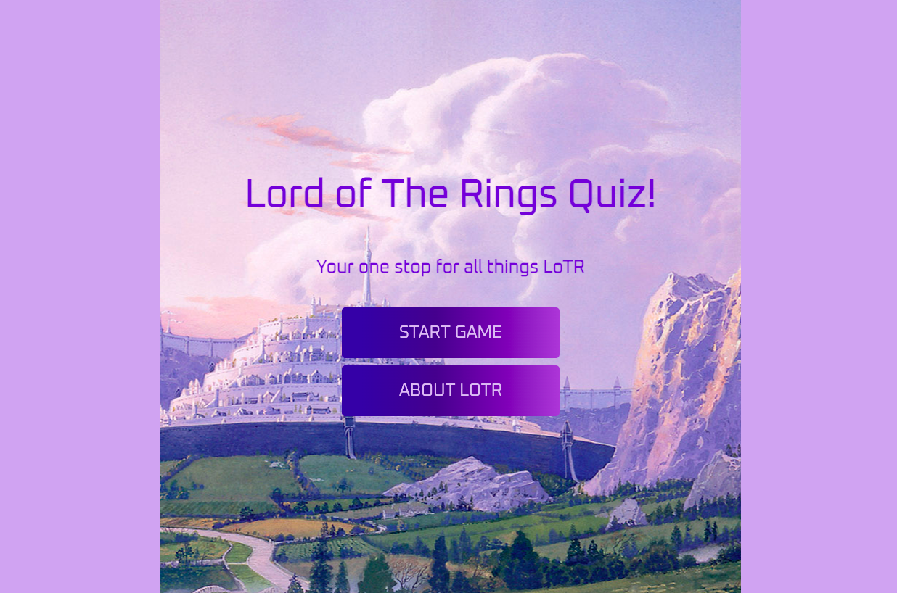
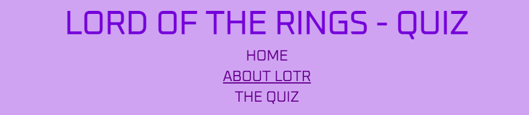
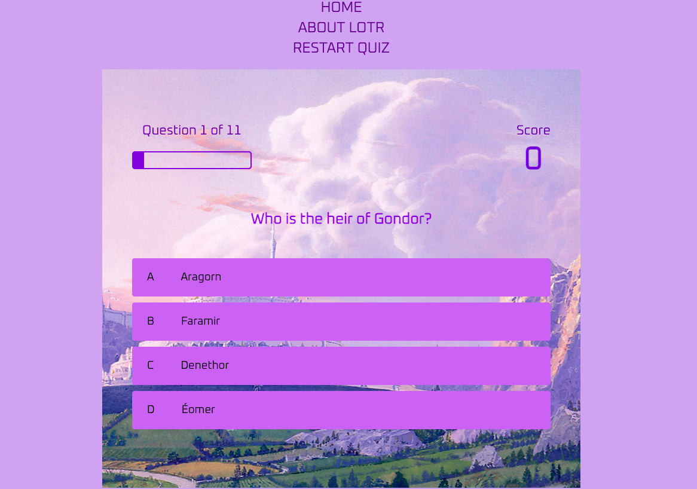
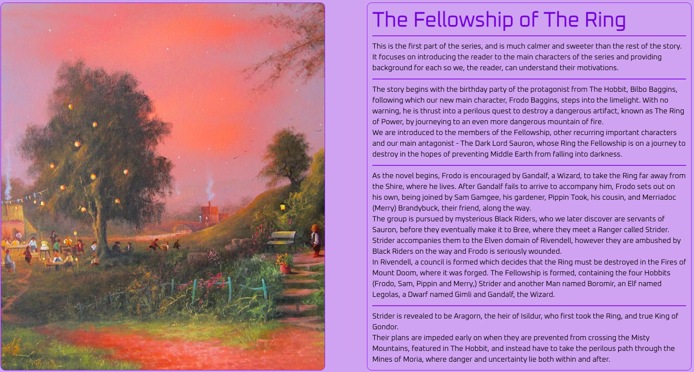
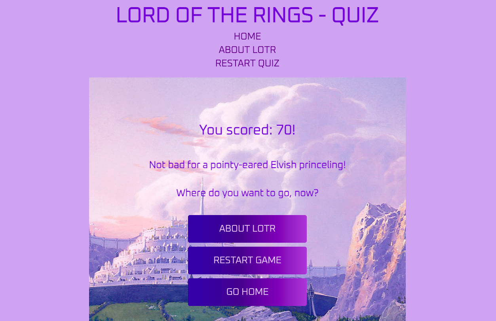
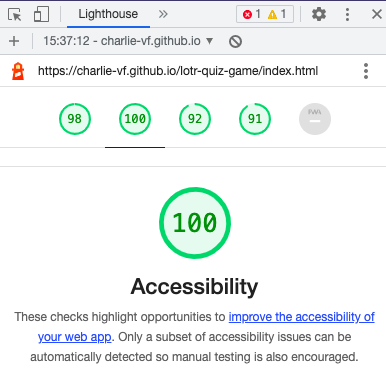
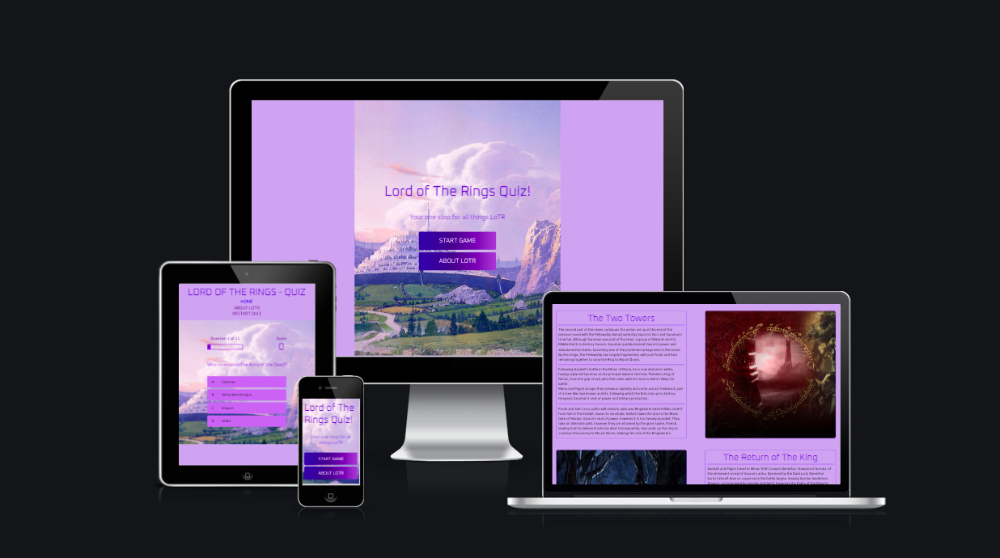

# Lord of The Rings Quiz

The live website can be found [here](https://charlie-vf.github.io/lotr-quiz-game/).
 

*In this README, I use 'Lord of The Rings' and its acronym, 'LoTR', interchangeably.*

# Table of Contents

- [Purpose](#purpose)
- [User Goals](#user-goals)
- [Design](#design)
    - [Colors](#colors)
    - [Images](#imagery)
    - [Fonts](#font)
- [Features](#features)
    - [Home Page](#home-page) 
    - [Nav Bar](#nav-bar)
    - [The Quiz](#the-quiz)
    - [About Page](#about-lord-of-the-rings-page)
    - [Results Area](#results-area)
- [Technologies](#technologies-and-sites-used)
- [Changes & Updates](#changes-and-updates)
- [Future Instalments](#future-instalments)
- [Testing & Validation](#testing-and-validation)
- [Deployment](#deployment-and-cloning)
- [Credits](#credits)
    - [Sites](#sites-which-helped-me-out)
    - [Other](#other-special-mentions)

## **Purpose**

This eleven-question quiz game was designed both for fans of Lord of The Rings to test their knowledge and for others to learn all about the series.

## **User Design and Experience**

## User Goals

- The site should be easy to navigate
- The site should be responsive to all devices
- To learn about the series and its creator
- To test my knowledge of Lord of The Rings

## **Design**

### **Colors**

The main color scheme of this site is purple:

- The background is a paler shade: rgb(198, 172, 241)
- The options buttons are slightly darker: rgb(185, 123, 244)
- The headings are darker: rgb(126, 82, 237)

Other text is either black or white, dependent on which is best for accessibility

### **Imagery**

I used one image across the homepage, game page and results area for consistency. It depicts Gandalf (a main character in the series) riding towards Minas Tirith, a major location of the final instalment: Return of the King.
I chose this image because it fits well with my chosen color scheme and does not detract from the main content of each page.
The image was taken from [Screen Rant](https://screenrant.com/lord-of-the-rings-interesting-facts-trivia-minas-tirith/).

I also incorporated accompanying images in the About LoTR page. As the page is quite content-heavy, I found that having a side-by-side image for each section of information breaks it up well and prevents the page from simply being an info-dump. Instead, it introduces people who may be unfamiliar with the series to the beauty of the visuals, and provides a nostalgia for those already familiar with Lord of The Rings. All images used on this page can be found in the docs folder.

### **Font**

The font used on this site is Oxanium, imported from [Google Fonts](https://fonts.google.com/specimen/Oxanium). I really like this font as it is neat and easy to read. 
I had considered using a font closer to the popular Elvish style writing from the source material, however, this would likely have been to elaborate a font and may have caused issues in reading.
I used text transform on the button texts of the main game page and results area for contrast and readability, as well as changing the font-sizes of various headings.

## **Features**

### **Existing Features**

### **Home Page**

The home page is very simple, featuring the site title and two buttons which link to the game itself and an information page which gives the user some information about Lord of The Rings.
By keeping it simple, this relates to the user goal of easy navigation.

### **Nav Bar**

The navigation bar is a feature of the About LoTR and Quiz pages. It provides links to the homepage, the About section and the quiz itself. I chose not to implement it on the home page and results areas as I felt using call-to-action buttons was the better choice, visually, for these pages.
The bar contains an active feature when on the About page, however this is not included when the user is in the quiz area as the button which links to the quiz is changed from saying 'The Quiz,' in the About page, to 'Restart Quiz,' and thus having an active bar on the link may cause confusion.
Clicking on the title above the navigation bar will also take the user back to the homepage.

### **The Quiz**

The quiz page features:
- A nav bar providing links to the homepage, about section and an option to restart the game
- A progress bar which updates as the user moves through the questions. I implemented this as it can be frustrating completing a quiz with no knowledge of how close you are to the end
- A score count which adds ten (10) each time the user selects a correct answer
- A center-aligned question
- Four (4) answer options to choose from
    - If the answer selected is correct, it will turn a light blue (rgb(28, 200, 177))
    - If the answer selected is incorrect, it will turn a burnt orange (rgb(255, 85, 0))
    - There is a 500ms delay before the next question is displayed, giving the user time to see the result of their choice before moving on
    - On hover, the answer option bars will expand, creating a more visual representation of what is about to be selected

### **About Lord of The Rings Page**

This page is quite content-heavy as it provides background on the series, its releases and adaptations, as well as giving an overview of all three written instalments of the series.
I enjoying adding educational sections to my websites so they are enjoyable and accessible by all, even those who may not have partaken in the content previously, or who simply do not know that much about the topic.
A couple of answers to the quiz are hinted at in this page, leaning again into making the quiz fun for everyone as some of the questions are less generic.

### **Results Area**

The results area displays once the final question has been answered. The relevant JavaScript hides the quiz area and removes the hidden feature from the results area. It features the user's score, a quote from the series based on whether their score was above or below 60/110, and buttons to Restart the game, visit the About page or navigate back to the Home page.

## **Technologies and Sites Used**

- HTML5 - Provided the structure for the site
- CSS - Provided styling and visuals
- JavaScript - Programmed the quiz and results area
- GitPod - Site for writing code and pushing it to the live website
- GitHub - Site for hosting the repo and deploying the website
- TinyPNG - Site for compressing images for faster load
- Google Fonts - Supplied Oxanium font

## **Changes and Updates**

- Originally, the results area was a separate page called results.html. This was changed so the results area was part of the main game.html content as it prevents users from simply being able to enter the URL for the results area and reach it without first needing to complete the quiz.

## **Future Instalments**

- I will likely add many more questions in the future to really fill out the quiz game. Once this has begun, I will add a highscores page so users can keep track of how they have been doing.
    - I chose not to include a highscores page at the current stage as there are only eleven (11) questions, and I wanted to focus more on providing information and context for the quiz.

## **Testing and Validation**

- I ensured the site is responsive across all screensizes using media queries, and checked this using DevTools and my own devices of various sizes
- I ensured the site is accessible using DevTools' Lighthouse feature and the site [PowerMapper](https://www.powermapper.com/) to provide detailed information

## **Deployment and Cloning**

This website was deployed using GitHub pages:
- In the GitHub repo, navigate to Settings
- Select Pages from the navigation bar
- Select branch:main and folder:/root
- Hit Save
- A link to the live website is provided (it may take a few minutes to go live)

The live website will update following any new commits and pushes to the main branch.
 

To clone this site and run it locally on your device:

- Copy the following text: git clone https://github.com/charlie-vf/lotr-quiz-game.git
- In your terminal, navigate to your chosen local directory
- Paste the copied text and hit enter

## **Credits**

### **Sites Which Helped Me Out**

- [This Playlist](https://www.youtube.com/watch?v=u98ROZjBWy8&list=PLDlWc9AfQBfZIkdVaOQXi1tizJeNJipEx) taught me how to design the Question Counter in the HUD, how to create and call on CSS to color a selected answer based on its accuracy and introduced me to the TimeOut feature.
    - I referred to this playlist throughout the production of my quiz if something was not working as intended
- [This Site](https://en.wikipedia.org/wiki/Adaptations_of_The_Lord_of_the_Rings) gave me the release dates for different adapations of the series
- [This Site](https://www.w3schools.com/jsref/jsref_forEach.asp) taught me about using forEach to call a function for elements in an array 

### **Image Sources**

- [Minas Tirith background image](https://screenrant.com/lord-of-the-rings-interesting-facts-trivia-minas-tirith/)
- [Background Info accompanying image](http://www.thehorrorzine.com/Odd/TolkienHome/TolkienHome.html)
- [Fellowship of The Ring accompanying image](https://www.pinterest.co.uk/pin/239746380150934555/)
- [The Two Towers accompanying image](https://www.youtube.com/watch?v=WJR78B7BaUQ)
- [Return of The King accompanying image](https://www.quotev.com/story/12040470/No-Blood-Just-Love-Lord-of-the-Rings/6)

### **Other Special Mentions**

- All information, other than the dates in the Background Info section, on the About page was taken from my own memory and rereads of The Lord of The Rings series.
- A big thank you to my mentor, Brian Macchiara, for continued support during the project
- Credit to the good people in the Slack server for helping out when things weren't working
